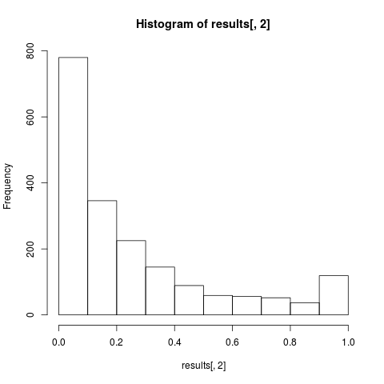
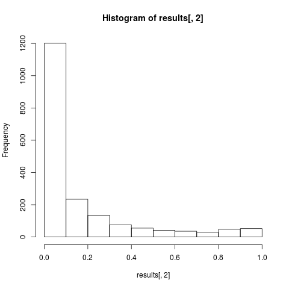
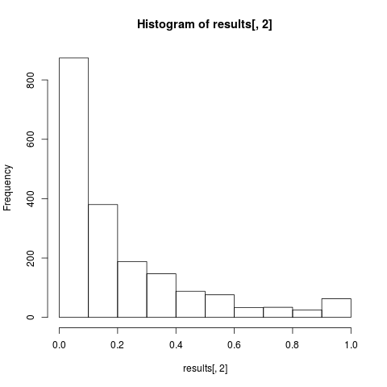

# kaggle-seizure-prediction
Work for 2016-09 to 2016-12 on [Melbourne University AES/MathWorks/NIH Seizure Prediction](https://www.kaggle.com/c/melbourne-university-seizure-prediction)

<!-- Ranking: Top 3% (13/478) -->

## Overview of the Challenge

The data provided for the challenge are 10-minute intracranial EEG (iEEG) signals from three persons with epilepsy.  For the training data, the iEEG clips are categorized as occurring an hour prior to seizure (preictal) or at least 4 hours before or after a seizure during normal brain activity (interictal).  

The goal of the challenge was to classify unlabelled iEEG signals from these patients as preictal or interictal.  Performance was evaluated using the area under the ROC curve, between the predicted probability of the preictal class and the correct classification

## Method description

### Feature extraction/selection

I used only frequency data from the EEG electrical signals for each patient (due to lack of time), following an approach somewhat similar to

> Junhua Li, Zbigniew Struzik, Liqing Zhang and Andrzej Cichocki. [Feature learning from incomplete EEG with denoising autoencoder.](http://www.bsp.brain.riken.jp/publications/2015/FeaturelearningfromincompleteEEG.pdf) Neurocomputing. 165 (2015) 25-36.

The details are as follows:

*	For each channel, I used a windowed Fourier transform to get the local frequencies in overlapping windows along the signal.  I chose a [Kaiser window](https://www.mathworks.com/help/signal/ug/kaiser-window.html) with the default \beta = 0.05, of window length 1000 points (= 2.5 s) and a small overlap of 1/4 of the window length (i.e. 250 points = 0.625 s). 
*	To further restrict the number of features, I selected only the frequencies in the 5-30 Hz range.  Li et al. restrict to 8-30 Hz for motor imagery, and a quick Internet search reveals that the range of frequencies traditionally associated to an epilepsy seisure is 0.1-0.5 Hz to 30-40 Hz although higher frequency oscillations are also likely to be important (e.g. Greg A. Worrell et al. [Brain (2004), 127, 1496-1506](http://brain.oxfordjournals.org/content/127/7/1496)).
*	For each channel, I took the mean of the frequencies across all windows. 
*	Similar to Li et al., I concatenated the frequency data of each of the 16 channels into a long feature vector for each patient. 

### Models

Because I did not have enough time, my strategy was to average many different types of models together.  

#### General Linear Model:

*    The first test model was a GLM on “macro” features of the data: the average and  standard deviation of the signals from the 16 channels for each 10-minute data clip.  _AUC: Public = 0.52_ (very poor!)
*    For all subsequent models, I used the feature vector described in the section above, for each data clip.  For the second model, I reweighed each sample in the training set by 1 - (the fraction of zeros in the file).  As described in the challenge data description, a large number of zeros represents "data dropout" where the implant has failed to record any signal.  Therefore, a signal with a large number of zeros is a lower-quality signal and less informative. _AUC: Public = 0.62_
*    For the third GLM model, I tried to address the class imbalance between preictal and interictal classes. I am not sure if this is the correct approach, but I changed the weight of a training sample to [1 - (the fraction of zeros in the file)]*[the fraction of observations with that outcome].  _AUC: Public = 0.757, Private: 0.745_

<!-- 2016-11-25-19%3A17%3A20_Basic.csv -->

#### Neural Network:

*    I tried a simple 1024-100-2 neural network, tanh activation layer, 20 epochs, weights as for the third GLM model. _AUC: Public = 0.716, Private = 0.683_
*    If I remember correctly, I tried 1000 epochs and a different number of hidden nodes in the middle layer, but the performance did not improve.

#### SVM:
*    Bootstrapped  `C-svc` SVM  model: sampled the training data 100 times with replacement to obtain the same number of samples as in the given training data. Class was weighted by the fraction of the observations with that outcome. _AUC: Public = 0.761, Private = 0.719_
*    Scaling the test data properly (using the mean and standard deviation of the training, rather than testing data) worsened performance.

<!-- 2016-11-27-14%3A17%3A48_all_svmModel.csv -->

#### Ensemble:

*    I started averaging predictions from different models. Averaging the GLM and SVM models improved performance.  The figure below shows the histogram of all prediction probabilities for all three patients, for GLM, SVM, and the average of the two.  For SVM,the bootstrapping underestimated the 1's whereas the GLM may have over-estimated them. _AUC: Public: 0.778, Private: 0.748_

GLM

SVM

Average

<!-- 2016-11-27-20%3A01%3A44_averagedPreds.csv -->

#### Random Forest:

*    A random forest model, with `mtry=2`, `ntree=200`, `nodesize=10`.  The classes were weighted by the fraction of the observations with that outcome. _AUC: Public = 0.717, Private = 0.702_

<!-- 2016-11-30-14%3A10%3A59_all_rfModel.csv -->

#### Final Ensemble:

*    To improve the neural network performance, I averaged 10 neural networks with the same structure, starting from different random seeds.  I changed some of the parameters from the previous neural network, most importantly, adding dropout. 
*    I averaged this NN model and the GLM, SVM, and RF models together for the final result.

### Code

The code for my last submission and the instructions on how to run it is in the [`clean-code`](https://github.com/canghel/kaggle-seizure-prediction) directory.

## Possible improvements

(Under construnction)

## Acknowledgments

I received a complimentary MathWorks MATLAB license to use for the competition and used MATLAB for my feature selection code. 